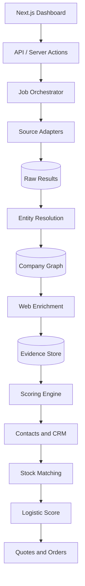

# Roadmap de producto — AgroBuyer Intelligence

> Documento vivo para construir, validar y desplegar una plataforma de descubrimiento, enriquecimiento y gestión comercial de compradores agrícolas B2B.

**Última actualización:** 24/09/2026  
**Laboratorio inicial:** papa · Córdoba, Argentina  
**Estado actual:** Sprint 1 completado · Supabase conectado · Sprint 2 pendiente de implementación

## 1. Visión del producto

AgroBuyer Intelligence debe transformar una necesidad comercial:

> «Tengo producción agrícola disponible y necesito saber qué empresas podrían comprarla, por qué son buenas candidatas, a quién contactar y si la operación tiene sentido logístico».

en un flujo verificable:

```text
Producto + ubicación
        ↓
Descubrimiento de empresas
        ↓
Resolución de identidad
        ↓
Evidencias y enriquecimiento
        ↓
Buyer Score
        ↓
Contacto y seguimiento comercial
        ↓
Stock ↔ comprador
        ↓
Oportunidad logística y venta
```

El producto no será un listado genérico de empresas ni un scraper aislado. Será un sistema de inteligencia comercial agrícola basado en datos trazables.

## 2. Principios no negociables

- **Evidencia antes que inferencia.** Una afirmación debe conservar fuente, URL, fecha, fragmento y confianza.
- **La IA extrae señales; el código calcula el score.** Las reglas de puntuación deben ser deterministas y versionadas.
- **Resultados crudos preservados.** Toda integración guarda primero la respuesta original para poder auditarla y reprocesarla.
- **Idempotencia.** Repetir una búsqueda no debe duplicar empresas, evidencias ni contactos.
- **Revisión humana para casos dudosos.** Nunca se fusionan empresas automáticamente solo por compartir nombre.
- **Adaptadores por fuente.** Places, SIFeGA, COMPR.AR y ARCA no deben contaminar el modelo de dominio.
- **Seguridad por defecto.** RLS, claves solo en servidor, mínimo privilegio y separación entre cliente, servidor y administración.
- **Cumplimiento y uso legítimo.** No se sortearán CAPTCHA, autenticaciones, restricciones técnicas ni condiciones de acceso.
- **Coste medible.** Cada job registra llamadas externas, errores, resultados y coste estimado.
- **Primero precisión comercial.** El éxito no es acumular empresas; es situar compradores realmente útiles entre los primeros resultados.

## 3. Alcance por releases

| Release | Resultado de negocio | Sprints |
|---|---|---:|
| 0.1 — Intelligence MVP | Encontrar, validar y priorizar compradores de papa en Córdoba | 1–5 |
| 0.2 — Commercial Intelligence | Localizar decisores y gestionar oportunidades comerciales | 6–9 |
| 1.0 — Potato Sales Platform | Relacionar producción disponible, compradores y logística | 10–13 |
| 1.x — Escala | Nuevas regiones/productos, automatización y producto SaaS | 14–17 |

Las fechas son secundarias frente a las puertas de validación. No se inicia una release si la anterior no alcanza sus métricas mínimas.

---

# RELEASE 0.1 — INTELLIGENCE MVP

## Sprint 1 — Base del motor de inteligencia ✅

**Objetivo:** establecer el modelo de dominio y demostrar un Buyer Score explicable.

### Completado

- [x] Proyecto Next.js 16, React 19 y TypeScript estricto.
- [x] Dashboard responsive inicial.
- [x] Dataset de validación inicial.
- [x] Buyer Score v1 determinista.
- [x] Desglose y explicación del score.
- [x] Contrato de evidencias con fuente y confianza.
- [x] Esquema inicial Supabase con PostGIS y RLS.
- [x] Query Generator y Entity Resolution iniciales.
- [x] Pruebas unitarias y build de producción.

### Deuda conocida

- [ ] Ampliar el gold dataset hasta 30–50 empresas revisadas.
- [ ] Añadir falsos positivos etiquetados.
- [ ] Sustituir datos locales por lecturas reales de Supabase.

**Definición de terminado:** cumplida para la base técnica; la ampliación del dataset continúa en paralelo.

## Sprint 2 — Discovery Engine V1 🟡

**Objetivo:** buscar empresas reales mediante Google Places, persistirlas y evitar duplicados.

### 2.1 Supabase operativo

- [ ] Validar migración `0001_initial_schema.sql` en el proyecto conectado.
- [ ] Confirmar extensión PostGIS.
- [ ] Crear organización y membresía del usuario.
- [ ] Crear clientes Supabase de navegador, servidor y administración.
- [ ] Verificar lectura/escritura con RLS.
- [ ] Crear migración `0002_discovery_engine.sql`.

### 2.2 Google Places

- [ ] Activar Places API (New) y facturación controlada.
- [ ] Restringir la API key al servicio necesario.
- [ ] Guardar `GOOGLE_PLACES_API_KEY` únicamente en servidor.
- [ ] Definir `FieldMask` mínimo.
- [ ] Establecer límites por job, consulta y página.
- [ ] Implementar `GooglePlacesClient` y `MockPlacesClient`.

### 2.3 Pipeline de discovery

- [ ] Generar consultas por producto, segmento y geografía.
- [ ] Crear `search_job` antes de ejecutar llamadas.
- [ ] Guardar cada respuesta en `raw_search_results`.
- [ ] Normalizar nombres, direcciones, tipos y coordenadas.
- [ ] Resolver coincidencias por Place ID y señales combinadas.
- [ ] Crear o actualizar la empresa canónica.
- [ ] Registrar estadísticas y errores parciales.

### 2.4 Interfaz

- [ ] Formulario “Nueva búsqueda”.
- [ ] Selector de producto, zona, radio y segmentos.
- [ ] Progreso del job.
- [ ] Resumen de nuevos, actualizados, duplicados y errores.
- [ ] Resultados reales en el dashboard.

### Métricas

- Resultados sin trazabilidad: **0%**.
- Empresas duplicadas después de procesar: **<10%**.
- Empresas incorrectamente fusionadas: **0**.
- Resultados con dirección: **≥80%**.
- Recuperación de empresas conocidas: **≥60%**.

**Definición de terminado:** una búsqueda desde la interfaz guarda empresas reales en Supabase y puede repetirse sin duplicarlas.

## Sprint 3 — Web Enrichment y clasificación

**Objetivo:** determinar qué hace cada empresa y obtener evidencia de su posible uso de papa.

### Crawler controlado

- [ ] Implementar cola de URLs pendientes.
- [ ] Respetar `robots.txt`, límites y timeouts.
- [ ] Priorizar inicio, productos, servicios, empresa, catálogo y contacto.
- [ ] Extraer texto limpio, título, metadatos y enlaces relevantes.
- [ ] Calcular hash del contenido y evitar recrawls innecesarios.
- [ ] Registrar estado, fecha, código HTTP y motivo de fallo.

### Extracción estructurada

- [ ] Diseñar esquema JSON versionado.
- [ ] Extraer tipo de comprador, uso de producto y modelo de negocio.
- [ ] Detectar señales de volumen sin inventar cantidades.
- [ ] Exigir fragmentos textuales y URL para cada claim.
- [ ] Rechazar respuestas sin evidencia válida.
- [ ] Permitir modelo cloud o endpoint compatible con OpenAI.
- [ ] Añadir pruebas con páginas guardadas como fixtures.

### Revisión humana

- [ ] Bandeja “Evidencias pendientes”.
- [ ] Acciones aprobar, corregir y rechazar.
- [ ] Historial del revisor y motivo.
- [ ] Diferenciar hipótesis, evidencia parcial y hecho verificado.

### Métricas

- Claims visibles sin fuente: **0%**.
- Precisión `uses_product` en muestra revisada: **≥85%**.
- Páginas procesables entre webs accesibles: **≥75%**.
- Alucinaciones aceptadas como evidencia: **0**.

**Definición de terminado:** el sistema explica con evidencia por qué una empresa puede o no utilizar papa.

## Sprint 4 — Fuentes argentinas e identidad empresarial

**Objetivo:** enriquecer la empresa comercial con identidad legal, actividad y señales de volumen.

### SIFeGA

- [ ] Validar método de acceso permitido y estable.
- [ ] Crear adaptador de establecimientos y productos.
- [ ] Relacionar RNE, razón social, CUIT, actividad y rubro.
- [ ] Guardar cobertura y fecha de actualización de la fuente.

### COMPR.AR

- [ ] Investigar formatos públicos reutilizables.
- [ ] Detectar procesos y órdenes relacionadas con alimentación.
- [ ] Extraer proveedor, CUIT, producto, cantidad, importe y fecha cuando existan.
- [ ] Crear señales de experiencia y volumen institucional.

### ARCA

- [ ] Documentar requisitos de Web Services y certificados.
- [ ] Integrar únicamente servicios autorizados.
- [ ] Normalizar denominación, actividades y estado fiscal.
- [ ] No automatizar páginas protegidas por CAPTCHA.

### Identidad canónica

- [ ] Mejorar resolución nombre comercial ↔ razón social.
- [ ] Añadir reglas por CUIT, dominio, teléfono y dirección.
- [ ] Gestionar cadenas, sucursales, plantas y marcas.
- [ ] Crear cola de posibles fusiones.
- [ ] Permitir separar una fusión incorrecta con auditoría.

**Definición de terminado:** las empresas prioritarias pueden mostrar identidad comercial, identidad legal, fuentes coincidentes y nivel de confianza.

## Sprint 5 — Buyer Score V2 y dashboard MVP

**Objetivo:** convertir los datos enriquecidos en una lista priorizada que un comercial pueda usar.

### Scoring

- [ ] Sustituir inputs manuales por señales persistidas.
- [ ] Versionar reglas y pesos.
- [ ] Separar `Buyer Score` de confianza de datos.
- [ ] Añadir penalizaciones por evidencia antigua o contradictoria.
- [ ] Recalcular al cambiar evidencias o reglas.
- [ ] Comparar ranking con el gold dataset.

### Dashboard

- [ ] KPIs reales desde Supabase.
- [ ] Tabla paginada y ordenada en servidor.
- [ ] Filtros por segmento, score, confianza, distancia, localidad y fuente.
- [ ] Vista de mapa con agrupación de puntos.
- [ ] Ficha 360° de empresa.
- [ ] Línea temporal de fuentes y cambios.
- [ ] Explicación completa del score.
- [ ] Exportación CSV limitada y auditada.

### Puerta de validación — Milestone 1

- [ ] Dataset de 30–50 empresas revisadas.
- [ ] Al menos 100 candidatos analizados automáticamente.
- [ ] Primeros 20 resultados revisados por una persona del negocio.
- [ ] Precision@20 **≥75%**.
- [ ] Al menos 10 empresas a las que tenga sentido llamar.

**Definición de terminado:** introducir “papa + Córdoba” produce un top 20 comercialmente defendible. Sin superar esta puerta no se desarrolla el CRM completo.

---

# RELEASE 0.2 — COMMERCIAL INTELLIGENCE

## Sprint 6 — Contact Enrichment

**Objetivo:** encontrar canales corporativos y 1–3 decisores relevantes solo para leads prioritarios.

- [ ] Definir cargos objetivo por tipo de empresa.
- [ ] Buscar compras, abastecimiento, operaciones, producción, gerencia o propiedad.
- [ ] Priorizar teléfono/email corporativo antes que datos personales.
- [ ] Conservar fuente, fecha, rol y confianza.
- [ ] Verificar formato y dominio de emails sin envíos no solicitados.
- [ ] Evitar dependencia estructural de scraping masivo de LinkedIn.
- [ ] Marcar contactos desactualizados o no verificados.
- [ ] Añadir solicitud de enriquecimiento bajo demanda.

**Definición de terminado:** al menos el 60% de los leads A dispone de un canal corporativo útil y el contacto muestra evidencia de su rol.

## Sprint 7 — Mini CRM

**Objetivo:** convertir inteligencia en ejecución comercial medible.

- [ ] Pipeline configurable: nuevo, por revisar, contactado, interesado, cotización, negociación, ganado y perdido.
- [ ] Responsable de lead.
- [ ] Notas e interacciones.
- [ ] Tareas y próxima acción.
- [ ] Motivos de pérdida.
- [ ] Adjuntos o enlaces a documentos comerciales.
- [ ] Historial de cambios.
- [ ] RLS por organización y roles.
- [ ] Panel de actividad y embudo.

**Definición de terminado:** un comercial puede trabajar una oportunidad sin una hoja de cálculo paralela.

## Sprint 8 — Automatización y alertas

**Objetivo:** transformar búsquedas puntuales en vigilancia comercial continua.

- [ ] Programar búsquedas recurrentes por zona/segmento.
- [ ] Detectar empresas nuevas y cambios significativos.
- [ ] Recrawl basado en antigüedad y prioridad.
- [ ] Recalcular scores afectados.
- [ ] Alertas dentro de la aplicación.
- [ ] Resumen periódico configurable.
- [ ] Límites de gasto por organización.
- [ ] Reintentos con backoff y dead-letter queue.
- [ ] Pausa y cancelación de jobs.

**Definición de terminado:** el sistema informa de nuevos compradores relevantes sin repetir ruido ni exceder límites configurados.

## Sprint 9 — Piloto comercial Córdoba

**Objetivo:** validar que el producto produce conversaciones y oportunidades reales.

### Muestra mínima

- [ ] 500 empresas descubiertas.
- [ ] 100 candidatas razonables.
- [ ] 30 leads A revisados.
- [ ] 15 leads contactados.
- [ ] Registrar respuestas, oportunidades y volumen declarado.

### Métricas de negocio

- Precision@20.
- Cobertura de contactos.
- Tasa de contacto efectivo.
- Tasa de respuesta.
- Lead → oportunidad.
- Tiempo de investigación ahorrado.
- Toneladas potenciales identificadas.
- Margen potencial frente a canal mayorista.

### Puerta de validación — Milestone 2

Debe existir evidencia de que el ranking genera mejores conversaciones que una búsqueda manual genérica. Si no ocurre, se corrigen discovery, evidencia y scoring antes de ampliar el producto.

---

# RELEASE 1.0 — POTATO SALES PLATFORM

## Sprint 10 — Producción e inventario

**Objetivo:** modelar lo que la empresa agrícola tiene disponible para vender.

- [ ] Campos, fincas y almacenes.
- [ ] Campañas y lotes.
- [ ] Producto, variedad, calibre, calidad y certificaciones.
- [ ] Cantidad disponible y comprometida.
- [ ] Fecha/ventana de disponibilidad.
- [ ] Presentación y tipo de envase.
- [ ] Precio objetivo y mínimo con permisos.
- [ ] Fotografías y documentación.
- [ ] Historial de movimientos.

**Definición de terminado:** el stock comercial disponible puede consultarse con cantidad, calidad, localización y fechas fiables.

## Sprint 11 — Matching stock ↔ comprador

**Objetivo:** recomendar compradores compatibles con cada lote disponible.

- [ ] Requisitos del comprador por producto y formato.
- [ ] Compatibilidad de variedad, calidad, volumen y calendario.
- [ ] Capacidad estimada sin falsa precisión.
- [ ] Restricciones comerciales.
- [ ] Buyer Score + compatibilidad + frescura del dato.
- [ ] Opportunity Score versionado.
- [ ] Explicación de cada recomendación.
- [ ] Creación de oportunidad desde el match.

**Definición de terminado:** seleccionar un lote devuelve una lista explicable de compradores compatibles y priorizados.

## Sprint 12 — Logística y rentabilidad

**Objetivo:** incorporar distancia y coste para priorizar operaciones viables.

- [ ] Geocodificar campos, almacenes y destinos.
- [ ] Distancia de carretera mediante proveedor configurable.
- [ ] Capacidad y tipo de vehículo.
- [ ] Coste estimado por viaje/tonelada.
- [ ] Pedido mínimo y ocupación.
- [ ] Ventanas de entrega.
- [ ] Logistic Score.
- [ ] Margen estimado después de transporte.
- [ ] Alertas por coordenadas o rutas dudosas.

**Definición de terminado:** el ranking diferencia entre buen comprador comercial y operación realmente rentable.

## Sprint 13 — Cotizaciones, pedidos y rutas básicas

**Objetivo:** cerrar el ciclo desde oportunidad hasta operación acordada.

- [ ] Crear cotización desde una oportunidad.
- [ ] Versiones de precio, cantidad y condiciones.
- [ ] Estado de aceptación.
- [ ] Conversión a pedido.
- [ ] Reserva de stock.
- [ ] Planificación básica de entregas.
- [ ] Agrupación de pedidos compatibles.
- [ ] Documentos PDF/CSV necesarios.
- [ ] Registro de resultado y margen real.

### Puerta de validación — Milestone 3

La aplicación debe acompañar al menos una operación real desde comprador detectado hasta pedido o descarte documentado.

---

# RELEASE 1.x — ESCALA Y PRODUCTIZACIÓN

## Sprint 14 — Nuevas geografías y productos

- [ ] Córdoba completa.
- [ ] Tucumán.
- [ ] Balcarce u otra zona acordada.
- [ ] Configuración de sinónimos y segmentos por producto.
- [ ] Fuentes específicas por jurisdicción.
- [ ] Reglas de scoring configurables sin cambiar código.
- [ ] Benchmark por región.
- [ ] Separar taxonomía “papa” del núcleo del producto.

**Definición de terminado:** añadir un producto o región consiste principalmente en configuración y validación, no en reescribir el pipeline.

## Sprint 15 — Calidad, observabilidad y costes

- [ ] Panel de salud de fuentes.
- [ ] Logs estructurados y trazas por job.
- [ ] Métricas de latencia, éxito y coste.
- [ ] Alertas por cambios de formato externos.
- [ ] Evaluaciones recurrentes de extracción y ranking.
- [ ] Backups y simulación de restauración.
- [ ] Retención de datos crudos.
- [ ] Políticas de borrado y rectificación.
- [ ] Presupuesto por fuente/organización.

## Sprint 16 — Seguridad y cumplimiento

- [ ] Revisión completa de RLS.
- [ ] Roles owner, admin, analyst y sales.
- [ ] Rotación de secretos.
- [ ] Rate limiting.
- [ ] Auditoría de exportaciones y accesos sensibles.
- [ ] Consentimiento y base legítima para comunicaciones.
- [ ] Política de privacidad y términos.
- [ ] Procedimiento de corrección/eliminación de datos.
- [ ] Pentest y revisión de dependencias.

## Sprint 17 — SaaS y operaciones

- [ ] Onboarding autoservicio.
- [ ] Configuración por organización.
- [ ] Planes, límites y facturación si se comercializa como SaaS.
- [ ] Entornos development, staging y production.
- [ ] CI/CD con migraciones controladas.
- [ ] Feature flags.
- [ ] Soporte y panel de administración.
- [ ] Analítica de producto.
- [ ] SLA y runbooks operativos.

---

## 4. Arquitectura objetivo



### Componentes estables

- **Frontend:** Next.js, React y TypeScript.
- **Datos:** Supabase PostgreSQL, PostGIS, Auth, Storage y RLS.
- **Jobs:** procesamiento asíncrono desacoplado cuando el volumen lo requiera.
- **IA:** proveedor intercambiable con salidas JSON validadas.
- **Fuentes:** adaptadores independientes.
- **Despliegue:** Vercel + Supabase inicialmente.

## 5. Modelo de datos objetivo

### Inteligencia empresarial

```text
organizations
organization_members
companies
company_brands
company_locations
company_sources
company_evidence
company_classifications
entity_match_candidates
buyer_scores
```

### Discovery y procesamiento

```text
search_queries
search_jobs
search_job_steps
raw_search_results
crawl_jobs
crawl_pages
extraction_runs
source_health
```

### Comercial

```text
contacts
leads
pipeline_stages
opportunities
interactions
tasks
quotes
orders
```

### Producción y logística

```text
farms
fields
warehouses
harvests
inventory_lots
buyer_requirements
matches
delivery_locations
route_estimates
shipments
```

## 6. Backlog transversal

Estas tareas no pertenecen a un único sprint y deben revisarse en cada entrega.

### Calidad

- [ ] Tests unitarios para reglas puras.
- [ ] Tests de integración para Supabase y adaptadores.
- [ ] Fixtures de todas las fuentes externas.
- [ ] Tests end-to-end del flujo principal.
- [ ] `typecheck`, `lint`, `test` y `build` en CI.

### Seguridad

- [ ] Ningún secreto en cliente o repositorio.
- [ ] RLS para toda tabla con datos de organización.
- [ ] Validación de inputs y respuestas externas.
- [ ] Límites de uso y protección contra abuso.
- [ ] Dependencias y migraciones revisadas.

### UX

- [ ] Estados de carga, vacío, error y reintento.
- [ ] Accesibilidad por teclado y contraste.
- [ ] Diseño responsive.
- [ ] Explicaciones comprensibles de confianza y score.
- [ ] Acciones peligrosas con confirmación.

### Datos

- [ ] Procedencia y fecha en todo dato enriquecido.
- [ ] Confianza separada del valor.
- [ ] Reprocesamiento reproducible.
- [ ] Versionado de prompts, extractores y scores.
- [ ] Auditoría de correcciones humanas.

## 7. Métricas norte

### Calidad del motor

- Precision@20.
- Recall sobre gold dataset.
- Tasa de duplicados.
- Tasa de fusiones incorrectas.
- Cobertura de evidencia.
- Antigüedad media de los datos.

### Utilidad comercial

- Leads A revisados.
- Leads con contacto válido.
- Contactos efectivos.
- Respuestas y oportunidades.
- Tiempo ahorrado por lead.
- Toneladas potenciales identificadas.

### Negocio

- Oportunidades ganadas.
- Volumen vendido directamente.
- Margen incremental.
- Coste de adquisición/enriquecimiento por oportunidad.
- Retención y uso recurrente si se convierte en SaaS.

## 8. Qué no se construye todavía

- Scraping masivo de LinkedIn.
- Envíos comerciales automáticos indiscriminados.
- Predicciones exactas de toneladas sin evidencia.
- Machine learning para sustituir reglas que aún no se han validado.
- Optimización avanzada de rutas antes de tener pedidos reales.
- Marketplace público antes de validar el flujo comercial privado.
- Aplicación móvil nativa.

## 9. Rutina para completar el roadmap

Al comenzar cada sprint:

1. Seleccionar un único objetivo medible.
2. Convertir sus casillas en issues pequeños.
3. Marcar dependencias y riesgos.
4. Definir fixtures y métricas antes de integrar fuentes.
5. Implementar el camino vertical mínimo.
6. Probar con datos reales limitados.
7. Registrar resultados y decisiones.
8. Actualizar este documento y el changelog.

Al finalizar:

- Todas las pruebas y la build pasan.
- Las migraciones están versionadas.
- No existen secretos en el repositorio.
- La funcionalidad puede demostrarse desde la interfaz.
- Las métricas del sprint están registradas.
- La siguiente decisión se basa en evidencia del producto.

## 10. Próxima acción

Continuar por **Sprint 2.1 — Supabase operativo**:

1. Confirmar que `0001_initial_schema.sql` está aplicada.
2. Verificar organización y `organization_members`.
3. Crear los tres clientes Supabase.
4. Leer una empresa desde Next.js respetando RLS.
5. Añadir `0002_discovery_engine.sql`.

Una vez superado ese checkpoint se implementará el adaptador de Google Places con fixtures y límites de coste.
