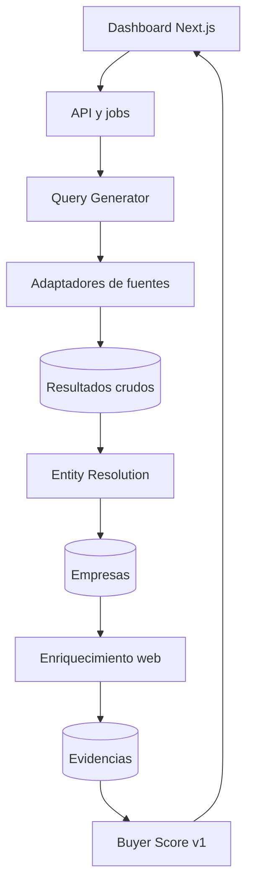

# Arquitectura del MVP



## Límites de módulos

- `query-generator`: produce consultas; no llama a proveedores.
- `source adapters`: traducen respuestas externas al formato interno.
- `entity-resolution`: propone coincidencias y explica sus señales.
- `enrichment`: obtiene texto y produce claims respaldados.
- `scoring`: transforma señales ya guardadas en puntos.
- `dashboard`: consume datos; nunca infiere hechos comerciales.

## Contrato de una evidencia

```json
{
  "claim_key": "uses_product",
  "claim_value": true,
  "excerpt": "La empresa fabrica papas fritas...",
  "source_url": "https://empresa.example/productos",
  "confidence": 0.96,
  "retrieved_at": "2026-09-21T00:00:00Z"
}
```

Una clasificación sin evidencia puede existir como hipótesis, pero no debe activar puntuación por uso demostrado.

## Buyer Score v1

| Componente | Máximo |
|---|---:|
| Evidencia de uso de papa | 30 |
| Volumen potencial | 20 |
| Tipo de comprador | 15 |
| Distancia | 15 |
| Tamaño de empresa | 10 |
| Contactabilidad | 10 |
| Total | 100 |

Versionar siempre las reglas (`score_version`) para no sobrescribir el significado histórico de un score.
